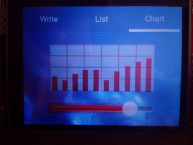
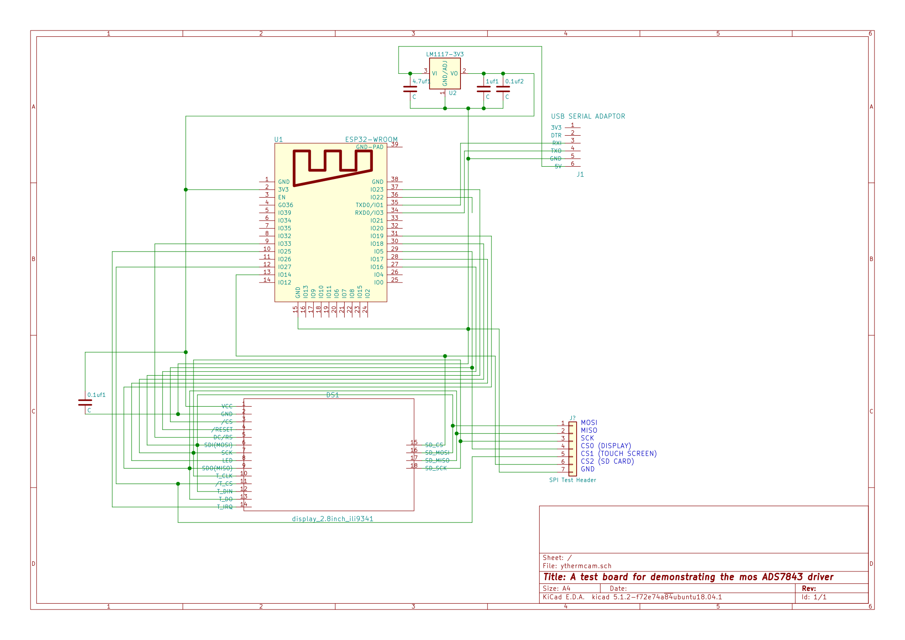

# LittlevGL Demo app

## Overview

This app shows how LittlevGL (https://docs.littlevgl.com/en/html/index.html) maybe used to drive a TFT display using the mgos IoT development framework.

This git repo contains submdules (lvgl and lv_examples). Therefore use the --recurse-submodules git command line option when cloing the repo. 

### Demo Display

### Demo Board Schematic

### Display Hardware
The display used is shown below

[Display details](http://www.lcdwiki.com/2.8inch_SPI_Module_ILI9341_SKU:MSP2807)
